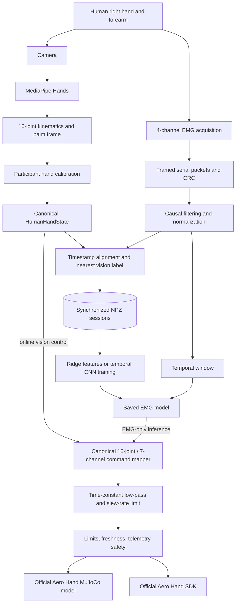

# EMG-Controlled Hand and Robotic Arm Research Platform

**A biomedical robotics testbed for vision-derived hand kinematics, surface-EMG learning, and robotic hand/arm control**

This repository is a biomedical robotics and prosthetics research platform combining physiological sensing, computer vision, machine learning, embedded acquisition, simulation, and physical robot control. Its central research direction is to use camera-observed hand motion as supervision for learning a continuous mapping from forearm EMG to intended hand configuration, then use that learned mapping without a camera at inference time. The repository also contains a mature, separate SO-arm vision-teleoperation and calibration stack used for robotic-arm experiments.

The code implements much of the software pipeline, but the repository does **not** contain EMG acquisition firmware, recorded EMG sessions, trained model checkpoints, or validated performance results. It is a research platform, not a clinically validated prosthesis.

## Overview

The project contains two related control paths:

1. **Right-hand / Aero Hand research path (`src/`)** — MediaPipe hand landmarks are converted into calibrated 16-joint hand kinematics and a compact seven-dimensional control target. The same canonical target can drive the official Aero Hand MuJoCo model or the physical hand through its SDK. A four-channel serial EMG path can be recorded alongside vision labels, trained with ridge regression or a temporal CNN, and substituted for vision at runtime.
2. **Legacy SO-arm path (root modules)** — camera-based hand position, depth, orientation, and gestures are mapped to an eight-motor SO-arm/parallel gripper platform. This path includes extensive camera, workspace, motor, and kinematic calibration plus an experimental object-detection pick-and-place system.

These paths share the broader research goal but are not a single monolithic controller. In particular, the Aero runtime directly controls the hand; its optional `--wrist-follow` adapter sends only three wrist targets to the existing SO-arm controller while holding the other arm joints neutral. The older `main.py` controls the SO arm and its gripper but does not run the EMG learning pipeline.

## Research Motivation

The long-term question is:

> Can multichannel surface EMG measured at the forearm predict intended hand motion accurately and stably enough to control a robotic or prosthetic hand?

A threshold controller such as `if EMG1 > threshold: close finger` discards temporal structure, couples one electrode to one preselected action, and does not naturally represent coordinated or partially flexed postures. This project instead formulates control as supervised learning from recent multichannel muscle activity to a calibrated, multidimensional hand state.

Computer vision is useful here because it provides non-contact observations of the hand during data collection. MediaPipe landmarks are converted into anatomical joint angles and normalized per participant. Those measurements become training labels for synchronized EMG. This does not establish clinical intent or ground-truth biomechanics—monocular landmark estimates have their own errors—but it creates a practical labeling mechanism for research-scale data acquisition.

## Current System Capabilities

| Subsystem | Status | Repository evidence and scope |
|---|---|---|
| Right-hand landmark tracking | **Implemented** | MediaPipe Hands detects one right hand; normalized image landmarks and world landmarks are retained. |
| Vision-derived hand kinematics | **Implemented** | Computes a palm frame, quaternion, 16 anatomical flexion channels, per-user normalization, and a seven-channel compact target. |
| Vision-to-Aero direct mimic | **Implemented** | A canonical command mapper drives MuJoCo, the official hardware SDK, or both from the same immutable command. |
| Aero Hand MuJoCo simulation | **Implemented and tested in code** | Uses the official right-hand Menagerie model and seven tendon/position controls; integration tests are included. |
| Physical Aero Hand backend | **Implemented; apparatus validation required** | Sends all 16 joint angles through `aero-open-sdk`, reads seven-actuator telemetry, and defaults to no motion unless explicitly enabled. |
| SO-arm vision teleoperation | **Implemented / actively configured** | Root runtime supports an eight-motor Feetech arm and gripper, camera tracking, calibration, asynchronous commands, and feedback. Current configuration uses proportional mapping, not Cartesian IK. |
| SO-arm Cartesian IK and workspace mapping | **Experimental / disabled by current configuration** | FK, DLS IK, calibrated workspace maps, residual corrections, and audits exist, but `values.py` disables the Cartesian path because current anchors select unsafe/unreliable branches. |
| SO-arm pick and place | **Experimental / partially deployable** | YOLO detection, ArUco localization, waypoint planning, and visual servo code exist; required top-down calibration files and model weights are not tracked. |
| Legacy SO-arm simulation | **Not active** | SO-ARM100/101 URDF assets are present, but the root `simulation.py` implementation is fully commented out. |
| Four-channel EMG serial acquisition | **Implemented in host software** | Packet parser, CRC validation, serial reader, MCU/host timestamps, calibration utility, and default 2 kHz configuration exist. Acquisition firmware and circuit design are absent. |
| EMG filtering and temporal windows | **Implemented** | Baseline removal, per-channel scaling, causal 60 Hz notch, fourth-order 20–450 Hz band-pass, 200 ms windows, and 50 ms stride are configured. |
| Synchronized EMG/vision recording | **Implemented in software; no dataset tracked** | Fits MCU time to host time, retains recent camera states, assigns the nearest vision label, and writes compressed NumPy sessions. |
| Feature-based EMG regression | **Implemented; untrained in repository** | MAV, RMS, waveform length, variance, zero crossings, and slope-sign changes feed a seven-output ridge regressor. |
| Temporal EMG model | **Implemented; experimental and untrained in repository** | A three-layer 1-D PyTorch CNN predicts seven normalized continuous hand controls. |
| EMG-only runtime control | **Implemented in software; not demonstrated by tracked artifacts** | A saved ridge or temporal checkpoint can drive simulation or the physical hand. No checkpoint or quantitative result is committed. |
| Clinical/prosthetic validation | **Planned research direction** | No human-subject protocol, clinical validation, force/tactile feedback, or performance claims are present. |

## System Architecture

The canonical Aero path separates sensing, representation, conditioning, safety, and actuation:



`HumanHandState` and `AeroCommand` are immutable internal boundaries. Vision and EMG therefore produce the same seven normalized controls and do not contain backend-specific actuation logic. The dispatch order is:

```text
sensor source → canonical hand state → anatomical command mapping
→ time-constant low-pass filter → per-channel slew limiter
→ joint/freshness validation → simulation and/or hardware backend
```

When the dual backend is selected, both children receive the same final `AeroCommand` object. Simulation then converts the 16 anatomical targets into Menagerie tendon controls; hardware sends all 16 desired joint angles to the SDK.

## EMG + Vision Supervised-Learning Architecture

### The essential distinction: training versus inference

During **training-data collection**, both sensors observe the same movement:

```text
Forearm EMG ── acquisition and filtering ──┐
                                           ├── synchronized labeled dataset ── model training
Camera ── landmarks and hand kinematics ───┘
```

The camera is the **teacher**: it generates an observable hand-state target while EMG is recorded. The learning set is conceptually

$$
\mathcal{D} = \{(E_i,H_i)\}_{i=1}^{N}
$$

where:

- $E_i$ is a recent multichannel EMG window;
- $H_i$ is the corresponding vision-derived hand state.

The implemented target is the following continuous seven-element vector:

$$
H =
\begin{bmatrix}
h_{\text{thumb abd}} &
h_{\text{thumb flex}} &
h_{\text{thumb curl}} &
h_{\text{index curl}} &
h_{\text{middle curl}} &
h_{\text{ring curl}} &
h_{\text{pinky curl}}
\end{bmatrix}
$$

The model learns parameters $\theta$ for

$$
\hat{H} = f_{\theta}(E)
$$

where:

- $E$ is the EMG input;
- $H$ is the camera-derived target;
- $\hat{H}$ is the model prediction;
- $\theta$ represents learned model parameters.

Training compares the prediction $\hat{H}$ with the camera-derived label $H$. This is continuous multivariate regression, not only OPEN/CLOSED classification.

During **inference**, the intended path is different:

```text
Forearm EMG → causal preprocessing → recent EMG window
→ trained model → predicted seven-dimensional hand state
→ canonical mapper and safety layer → robotic hand
```

The camera is not required by the implemented EMG inference source. It is used to create supervision during collection and to provide a comparison/control mode—not as a permanent input to the trained model.

### 1. EMG acquisition

The host expects an external MCU/ADC to send one sample per framed packet. The default configuration is four channels at 2,000 samples/s over a 921,600-baud serial link. The repository does not include the MCU firmware, ADC part number, wiring, electrode placement, or a MyoWare-specific electrical interface; MyoWare is therefore a project direction/hardware assumption rather than a repository-verifiable driver.

The little-endian wire frame is:

| Field | Type | Meaning |
|---|---|---|
| Sync | bytes `A5 5A` | Frame boundary |
| Version | `uint8` | Must be `1` |
| Channel count | `uint8` | Must match configured channels |
| Sequence | `uint32` | Packet sequence number |
| MCU time | `uint32` | Microseconds on the acquisition clock |
| Samples | N × `uint16` | Raw ADC readings |
| CRC | `uint16` | CRC16-CCITT over all preceding frame bytes |

The parser resynchronizes after corrupt bytes and rejects version, channel-count, or CRC mismatches. It does not currently report packet-loss statistics from the sequence counter.

### 2. Computer vision as the training label

MediaPipe Hands returns 21 landmarks. The runtime retains normalized image coordinates for visualization/audit and uses MediaPipe world landmarks for geometry when available; image landmarks are a documented fallback.

From those landmarks, the code computes:

- a right-handed palm coordinate frame with radial, distal, and palm-normal axes;
- an `(x, y, z, w)` palm quaternion;
- four thumb channels (CMC abduction, CMC flexion, MCP flexion, and IP flexion);
- MCP, PIP, and DIP flexion for each of the four fingers, for 16 channels total;
- a calibrated 16-element normalized state and the seven-element compact target used by EMG learning/control.

This is richer than a categorical gesture label. Palm orientation and raw landmarks are recorded in vision sessions, but the current EMG models predict only the seven hand-articulation controls—not palm orientation, wrist orientation, arm reach, or all 16 joints independently.

### 3. EMG representation and preprocessing

The default causal preprocessing chain is:

1. subtract the per-channel rest median (`baseline`);
2. apply a causal 60 Hz IIR notch filter with Q = 30;
3. apply a causal fourth-order 20–450 Hz Butterworth band-pass;
4. divide by the per-channel calibration scale (the 95th percentile of absolute active signal relative to baseline);
5. buffer 0.2 s (400 samples at 2 kHz) with a 0.05 s (100-sample) stride.

The standalone EMG calibration records three seconds by default for rest, open palm, fist, four individual-finger flexions, thumb opposition, and pinch. It saves baseline, scale, useful percentiles, saturation fraction, and per-pose summary statistics. It does not train a classifier.

An input-validation helper checks finite values, nonzero channel variance, and gross ADC saturation, but the main runtime does not currently call that helper to reject a window. The runtime's displayed confidence is a simple heuristic based on processed amplitude and raw values lying strictly between 0 and 4095; it is not a calibrated probability and is not passed into `HumanHandState` (which currently receives confidence `1.0` for an emitted EMG prediction).

### 4. Dataset construction and synchronization

Each received EMG packet has both its MCU timestamp and the host's monotonic receive timestamp. `ClockAligner` continuously fits a linear mapping between the MCU and host clocks, allowing drift as well as offset to be estimated. The recorder maintains up to 240 recent vision observations and selects the observation nearest the requested label time.

With the default center-label convention, an EMG sample at the end of a prospective 200 ms window is paired with the vision state 100 ms earlier. When training constructs a window ending at that sample, its target therefore approximates the state at the window center. `label_reference: end` is also supported.

Each synchronized record may contain:

- raw and causally processed EMG;
- MCU, receive, aligned-host, and label timestamps;
- camera timestamp and frame number;
- 21 image and 21 world landmarks;
- 16 anatomical angles and 16 normalized joint values;
- seven compact targets and 16 Aero command angles;
- tracking confidence, calibration ID, and serialized backend telemetry.

Sessions are written as compressed `.npz` files. The logger buffers records in memory until shutdown; abrupt process termination can therefore lose a session. There is no repository-level schema version or dedicated dataset-conversion CLI.

### 5. Learning objectives and implemented models

Both implemented models solve seven-output bounded regression:

| Model | Input | Output | Training objective/status |
|---|---|---|---|
| Ridge baseline | Six features per channel: mean absolute value, RMS, waveform length, variance, zero crossings, slope-sign changes | Seven values clipped to `[0,1]` | Closed-form L2-regularized linear regression |
| Temporal CNN | Raw processed window shaped channels × time | Seven sigmoid outputs | Three Conv1D blocks, adaptive pooling, and Smooth L1 loss; optional output-velocity penalty |

The CNN consumes past buffered samples at runtime. Its convolutions use symmetric padding inside the already-collected window; it is suitable for windowed inference, but it is not a streaming dilated causal-convolution architecture.

Training splits input files by complete session (default 70/15/15) before windowing. With the current integer rounding, at least four sessions are required to make all three partitions nonempty, even though the scripts' error text says three. This avoids the severe leakage that would occur if temporally adjacent windows from one recording were randomly distributed across train and test sets. The temporal trainer loads and returns the validation windows but does not use validation loss for early stopping, checkpoint selection, or hyperparameter selection.

### 6. EMG-only inference

At runtime, a ridge `.npz` or temporal `.pt` checkpoint consumes each completed EMG window. The seven clipped predictions are expanded to a 16-joint hand state, passed through the same command mapper used by vision, conditioned, safety-checked, and sent to MuJoCo and/or hardware. A 0.25 s source timeout triggers the configured fault action.

No trained checkpoint is tracked at the configured `models/emg_baseline.npz` path, so EMG inference commands require the user to collect sessions and train a model first. The code path exists; demonstrated accuracy and physical-control quality do not.

### 7. Why temporal modeling matters

Surface EMG is time-varying, noisy, and affected by activation onset, contraction history, and electromechanical delay. A single ADC sample provides little context. The implemented 200 ms window gives the model recent temporal structure, while a 50 ms stride permits overlapping updates. The ridge baseline summarizes that history; the CNN learns filters across time. These values are configuration defaults, not experimentally optimized results.

## Computer Vision and Hand Tracking

### Aero Hand path

`VisionSource` mirrors camera frames because MediaPipe handedness is defined for selfie-style input. It accepts only a detected right hand and defaults to a 0.7 detection/tracking confidence threshold. A five-pose participant calibration records medians for:

- open palm;
- closed fist;
- maximum thumb abduction;
- thumb opposition across the palm;
- thumb–index pinch.

Open/closed medians establish per-joint normalization. Thumb-specific poses replace selected closed-state anchors because a fist alone does not span the thumb's relevant abduction/opposition range. Values are clipped to `[0,1]` and then reduced to seven controls with configurable averaging weights. There is no explicit temporal landmark filter before this calibration mapping; command-space low-pass and slew limiting happen later.

Palm orientation is represented relative to a neutral frame only when optional SO-arm wrist following is enabled. The relative rotation is converted to a rotation vector, reordered/signed according to configuration, offset, and clamped. This wrist path must be validated on the actual mechanism because camera and robot axes are installation-dependent.

### Legacy SO-arm path

The older `HandTracker` supports a broader teleoperation stack: handedness selection, normalized image position, monocular depth from calibrated hand size, optional ArUco glove depth, palm/wrist orientation, open/close and snap/clap gestures, calibrated human-to-robot workspace maps, and asynchronous IK. Calibration utilities cover ChArUco intrinsics, ArUco extrinsics, hand depth, paired hand/robot workspace poses, and audit reports.

The current final settings in `values.py` explicitly set `HAND_USE_CARTESIAN_IK=False` and `HAND_CARTESIAN_MAPPING_ENABLED=False`. Therefore the active root runtime uses the older proportional mapping for hand x/y/depth to shoulder pan, shoulder lift, elbow flex, and wrist flex, with optional palm roll. The DLS Cartesian solver and learned residual workspace maps remain experimental until calibration and branch selection are corrected.

## Robot Control

### Aero robotic hand

The Aero representation exposes 16 anatomical joint targets but uses seven compact actuator groups:

| Human/learned input | Aero output |
|---|---|
| Thumb abduction | Thumb CMC abduction |
| Thumb flexion | Thumb CMC flexion/opposition channel |
| Thumb curl | Combined thumb MCP/IP tendon target |
| Index curl | Index MCP/PIP/DIP targets |
| Middle curl | Middle MCP/PIP/DIP targets |
| Ring curl | Ring MCP/PIP/DIP targets |
| Pinky curl | Pinky MCP/PIP/DIP targets |

The 16 configured joint limits are 100° for thumb CMC abduction, 55° for thumb CMC flexion, and 90° for the remaining 14 channels. The mapper preserves the vision-derived per-joint proportions for 16-joint commands while forming each compact finger curl with configurable weights. EMG predictions are compact, so expansion assigns one predicted curl to all joints in that finger group.

Commands receive an exponential filter (`tau = 0.08 s` by default), then normalized per-group slew limits. The safety supervisor rejects invalid/stale commands, clips joint targets, and checks current, temperature, speed, and communication freshness. Configured fault actions are `hold` (default), `controlled_open`, or `disable`; the safest choice is apparatus-dependent, because opening can also create a hazard.

The real backend is inert unless `--enable-hardware` is passed. It configures seven actuators, verifies communication with a telemetry read, sends a full 16-angle position target, and polls current, speed, and temperature through the official SDK.

### SO arm and gripper

The legacy arm command contains seven rotational joints plus a normalized gripper:

```text
shoulder_pan, shoulder_lift, elbow_flex, wrist_flex,
wrist_yaw, wrist_roll, wrist_pitch, gripper_open01
```

The physical implementation uses eight Feetech STS3215 motors over a serial bus. Project calibration maps radians (or gripper percentage) into each motor's recorded raw-position limits and drive direction. The controller supports direct packet I/O or a LeRobot-compatible bus, asynchronous latest-command delivery, torque limits, position feedback, and optional outer-loop PID. The checked-in final configuration enables the real robot, auto-detects its serial port, runs the command loop at high nominal rates, and applies per-motor torque limits; users must review `values.py` for their apparatus before launch.

The optional Aero `--wrist-follow` bridge does **not** command the whole arm. It holds the configured shoulder/elbow joints at neutral, keeps the gripper open, and maps three relative palm-rotation axes to configured wrist joints.

## Simulation

The active simulator is MuJoCo with the official `tetheria_aero_hand_open/scene_right.xml` model from `mujoco-menagerie`. It is used to:

- inspect vision or EMG commands without physical motion;
- exercise the same canonical command sent to hardware;
- validate the published joint-to-actuation coupling;
- compare commanded tendon lengths and resulting joint motion.

Sixteen desired anatomical angles are transformed with the Chestnut/Aero joint-to-actuation equations into seven actuator rotations. Four finger tendons and two thumb tendons are converted using 9 mm pulley travel; thumb abduction maps directly to the model control. Controls are clipped to the official model ranges. The configured physics time step is 10 ms and the runtime advances up to 20 catch-up steps per loop.

The repository also includes upstream SO-ARM100/101 URDF, MuJoCo XML, mesh, STEP, and STL assets. The old root `simulation.py` contains a PyBullet design, but every line is commented; it must not be treated as an operational simulator.

## Hardware

### Current or directly supported hardware

| Component | Role | Repository certainty |
|---|---|---|
| Right Aero Hand | 16-joint, seven-actuator robotic hand target | Official SDK and simulation backends are implemented; exact installed revision is not recorded. |
| SO-ARM100/101-derived arm | Seven arm joints plus parallel gripper | CAD/submodule assets, eight-motor calibration, and controller are present. |
| Feetech STS3215 servos | Legacy arm actuation | Eight configured motor IDs and direct serial protocol support. |
| UVC-compatible camera | MediaPipe hand tracking | OpenCV camera index 0 by default; no exact camera model is declared. |
| External MCU/ADC | Four-channel EMG packet source | Host protocol is defined; the board, ADC, firmware, and isolation implementation are not included. |
| Host computer | Vision, learning, simulation, and control | Python application; configuration contains macOS-specific support for `mjpython` and MPS for YOLO. |

### Planned/research hardware direction

Surface electrodes and MyoWare-style forearm EMG sensing are part of the intended research architecture, but this repository alone does not identify a verified MyoWare model, ADC, microcontroller, electrode montage, or isolated power design. Likewise, a clinically styled prosthetic socket, tactile/force sensors, and a validated physical prosthetic hand are not documented as complete.

Communication interfaces are USB/serial for the EMG packet source and robot controllers, plus a local camera interface through OpenCV. No wireless transport is implemented.

## Software Stack

| Technology | Role |
|---|---|
| Python | Runtime, calibration, acquisition, modeling, and robot control |
| NumPy / SciPy | Geometry, filtering, features, regression, and metrics |
| MediaPipe Hands | 21-point image/world hand landmarks and handedness |
| OpenCV | Camera capture, overlays, ArUco/ChArUco calibration, and image geometry |
| PyTorch | Temporal 1-D CNN training and inference |
| MuJoCo / MuJoCo Menagerie | Official Aero Hand simulation |
| `aero-open-sdk` | Physical Aero Hand commands and telemetry |
| PySerial | EMG and direct Feetech serial communication |
| LeRobot | Optional SO-arm motor-bus integration |
| Ultralytics YOLO | Experimental legacy pick-and-place object detector |
| Matplotlib | Optional EMG visualization and sim/real comparison plots |
| PyYAML | Layered runtime configuration |
| pytest | Unit and integration tests |

## Repository Structure

```text
ECE3161/
├── README.md                 # This authoritative project overview
├── configs/                  # Aero hand, vision, EMG, safety, hardware, MuJoCo defaults
├── src/
│   ├── app/                  # Unified Aero runtime and vision/EMG/playback sources
│   ├── perception/           # Hand geometry and participant calibration
│   ├── emg/                  # Serial protocol, causal preprocessing, temporal buffer
│   ├── logging/              # Session serialization and clock alignment
│   ├── ml/                   # Features, ridge model, temporal CNN, splits, metrics
│   ├── control/              # Anatomical mapping, filtering, slew limits, safety
│   ├── backends/             # MuJoCo, hardware, and dual Aero backends
│   ├── models/               # Canonical immutable hand/command representations
│   └── arm/                  # Optional SO-arm wrist-follow adapter
├── scripts/                  # Calibration, collection, training, validation, launch helpers
├── tests/                    # Geometry, protocol, safety, backend, runtime, and model tests
├── calibration_data/         # Checked-in hand, camera, arm, and workspace calibrations
├── main.py                   # Full legacy SO-arm camera/control runtime
├── handtracking.py           # Legacy tracking, gestures, depth, mapping, and IK integration
├── mathmodel.py              # SO-arm FK, Jacobian, DLS IK, and secondary costs
├── robot_controller.py       # Feetech/LeRobot physical arm controller
├── camera_calibrate.py       # Intrinsic, extrinsic, depth, and workspace workflows
├── pick_place_*.py           # Experimental detection/planning/runtime stack
├── values.py                 # Large legacy configuration surface; final overrides matter
└── SO-ARM100/                # Git submodule with upstream CAD, meshes, and robot models
```

`ARCHITECTURE.md`, `README_AERO.md`, and `SAFETY.md` remain in the tree for history/convenience, but this README incorporates their substantive architecture, runtime, and safety content and does not depend on them.

## Runtime Data Flow

### Vision-based Aero control

1. OpenCV captures and mirrors a camera frame.
2. MediaPipe identifies one right hand and returns 21 landmarks.
3. World-landmark geometry produces 16 angles and a palm frame.
4. Participant calibration normalizes each angle; weighted reduction produces seven controls.
5. Mapping, filtering, slew limiting, freshness checks, and joint clamps produce `AeroCommand`.
6. MuJoCo, the real hand, or both receive that same command.

### EMG training-data mode

1. Vision remains the live controller and populates a recent observation history.
2. The serial reader parses raw multichannel EMG packets.
3. Receive observations update a linear MCU-to-host clock fit.
4. EMG is causally filtered and normalized.
5. Each sample is paired with the nearest camera hand state at the selected center/end label time.
6. Raw signals, processed signals, timing, landmarks, kinematics, command labels, and telemetry are saved to one session.

### EMG-only inference mode

1. Serial EMG is parsed and preprocessed with the same configured chain.
2. A 400-sample window is emitted every 100 samples under the defaults.
3. A trained ridge or CNN model predicts seven continuous controls.
4. The canonical control and safety pipeline drives simulation or hardware.
5. If no prediction arrives for 0.25 s, the configured fault action is applied.

### Legacy SO-arm mode

1. A low-latency camera reader drops old frames and supplies the newest frame.
2. The legacy tracker estimates hand position, depth, palm orientation, openness, and gestures.
3. The currently enabled proportional mapper produces seven arm joints plus gripper state.
4. The controller clips through calibration limits and sends only the latest command asynchronously.
5. Optional snap/key input transfers control to the experimental pick-and-place state machine.

## Setup

### Environment

No Python version is declared in project metadata. Use an isolated environment with a Python version supported by all pinned packages (especially MediaPipe 0.10.11 and PyTorch 2.2.2); do not assume the newest Python release is compatible.

```bash
python -m venv .venv
source .venv/bin/activate
python -m pip install --upgrade pip
python -m pip install -r requirements.txt
```

The SO-ARM100 directory is a Git submodule. If it is absent after cloning:

```bash
git submodule update --init --recursive
```

Confirm the installed official Aero model:

```bash
python scripts/setup_mujoco.py
```

The package dependency can supply the model. The script also accepts one or more local Menagerie roots:

```bash
python scripts/setup_mujoco.py /path/to/mujoco_menagerie
```

### Calibrate vision before using the Aero runtime

```bash
python scripts/calibrate_hand.py
```

Hold each prompted right-hand pose and press Space to record it; Esc cancels without writing a file. A calibration is already tracked at `calibration_data/aero_right_hand_calibration.json`, but it is participant- and camera-geometry-specific and should not be assumed valid for another user.

### Run vision-driven simulation

```bash
python -m src.app.runtime \
  --source vision \
  --backend sim \
  --show-camera \
  --show-mujoco
```

On macOS, the runtime automatically relaunches under `mjpython` when the MuJoCo viewer is requested. The helper script runs the same mode:

```bash
python scripts/run_vision_sim.py
```

Without `--show-mujoco`, simulation can run headless. Add `--diagnostics` for rate-limited tracking/command/control diagnostics.

### Physical Aero Hand

First run a non-moving dry run; a `real` backend does not construct the SDK object unless hardware is explicitly enabled:

```bash
python -m src.app.runtime --source vision --backend real --show-camera
```

After verifying hand identity, port, homing behavior, limits, speed/torque settings, telemetry, fixture, and emergency power disconnect:

```bash
python -m src.app.runtime \
  --source vision \
  --backend real \
  --show-camera \
  --enable-hardware
```

Use `--backend both` to send the same conditioned command to MuJoCo and hardware. The `scripts/run_vision_real.py` wrapper intentionally omits `--enable-hardware` and is therefore a dry run unless extra arguments are added through the module command above.

### Calibrate and record EMG

Connect firmware that emits the documented packet format, then edit `configs/emg.yaml` for the correct port, channel count, rate, and filters.

```bash
python scripts/calibrate_emg.py --port /dev/ttyACM0
```

Record synchronized EMG while vision remains the controller:

```bash
python -m src.app.runtime \
  --source vision \
  --backend sim \
  --record-emg \
  --show-camera
```

The default output is `recordings/session.npz`. Override it with a YAML file containing `record_path`, passed via `--config`. Reusing the default path overwrites the previous session when the logger closes, so assign a unique filename for every experimental session.

### Train EMG models

At least four separately recorded session files are required by the current 70/15/15 integer split. Create the output directory first because the ridge model saver does not create its parent directory.

```bash
mkdir -p models
```

Feature/ridge baseline:

```bash
python scripts/train_emg_model.py \
  recordings/session_01.npz \
  recordings/session_02.npz \
  recordings/session_03.npz \
  recordings/session_04.npz \
  --output models/emg_baseline.npz
```

Temporal CNN:

```bash
python scripts/train_emg_temporal.py \
  recordings/session_01.npz \
  recordings/session_02.npz \
  recordings/session_03.npz \
  recordings/session_04.npz \
  --output models/emg_temporal.pt
```

The scripts print held-out regression metrics; they do not save a separate report for the ridge model. No example sessions or checkpoints are committed.

### Run EMG-only inference

Set `model_checkpoint` in `configs/emg.yaml` to the saved ridge or temporal model, then run:

```bash
python -m src.app.runtime \
  --source emg \
  --backend sim \
  --config configs/emg.yaml \
  --show-mujoco \
  --show-emg
```

For physical motion, replace `sim` with `real` and add `--enable-hardware` only after validating the model and safety behavior in simulation. `scripts/run_emg_sim.py` and `scripts/run_emg_real.py` are minimal wrappers; the real wrapper remains non-moving because it does not enable hardware.

### Legacy SO-arm runtime

Review the final overrides in `values.py` before connecting the robot. The checked-in configuration has `ENABLE_REAL_ROBOT=True`.

```bash
python main.py --list-cameras
python main.py
```

`main.py` interactively invokes motor/joint calibration when required, auto-detects the serial port when possible, and opens the tracking UI. Esc exits; `p` requests pick/place; `c` cancels pick/place. The pick/place mode additionally requires top-down calibration files and YOLO weights that are not tracked, so it may report itself unavailable.

### Tests and validation

```bash
python -m pytest -q
python scripts/validate_mujoco.py
```

The MuJoCo integration tests skip if optional simulation dependencies are unavailable. Use `python -m pytest`, rather than relying on a globally installed `pytest` launcher, to ensure the repository root is on the module path.

## Calibration

### Required for the Aero vision path

- **Hand calibration:** five right-hand poses saved by `scripts/calibrate_hand.py`. This is mandatory for `VisionSource`.
- **EMG calibration:** rest and movement recordings saved by `scripts/calibrate_emg.py`. The runtime can technically use zero/one defaults if the file is missing, but participant-specific baseline/scale calibration is strongly recommended and expected for meaningful work.

### Required for physical robot paths

- **Aero hardware:** no automated repository calibration exists beyond hand/EMG calibration. Port, right-hand firmware, automatic homing behavior, limits, speed, torque, and telemetry must be validated on the actual hand.
- **SO arm:** `robot_calibrate.py` manages motor IDs, direction/range, neutral positions, and workspace poses. Checked-in files under `calibration_data/` describe one apparatus and must not be assumed transferable.

### Optional/experimental camera and workspace calibration

`camera_calibrate.py` supports ChArUco intrinsics, ArUco extrinsics, monocular hand-depth anchors, and paired human/robot workspace poses. Audit tools under `scripts/` examine mirror/workspace anchor ordering, coverage, and reproduction error. These are primarily for the legacy SO-arm Cartesian/workspace path, which is currently disabled in favor of proportional mapping.

Generated calibration artifacts live in `calibration_data/`; model-calibration candidates may also use `calibration_artifacts/`. Some files contain apparatus-specific absolute assumptions, and `values.py` currently includes an absolute local `URDF_PATH`, so portability requires review.

## Research Workflow

The code supports the following experimental sequence, although the repository does not yet include data showing that the entire sequence has been completed:

1. Define an electrode montage and use an isolated, body-safe acquisition chain.
2. Configure the serial port, channel count, sample rate, and filter band.
3. Calibrate the participant's five vision poses.
4. Calibrate EMG rest/active ranges for the current electrode placement.
5. Record multiple synchronized sessions containing representative continuous hand movements.
6. Inspect packet continuity, saturation, tracking confidence, timing, and label quality.
7. Keep complete sessions separate and train the ridge baseline.
8. Train the temporal CNN only after establishing the baseline and sufficient data volume.
9. Evaluate held-out sessions, ideally including electrode replacement and later-day sessions.
10. Validate predicted motion and timeout behavior in MuJoCo.
11. Progress to low-risk physical-hand trials with conservative speed/torque and a power disconnect.
12. Study stability, latency, generalization, and controllability under EMG-only operation.

## Evaluation Strategy

Implemented regression metrics are per-output mean absolute error (MAE), root mean square error (RMSE), coefficient of determination (R²), and correlation, plus average batch inference latency. The training scripts also print overall mean MAE/RMSE. `compare_sim_real.py` computes per-channel MAE/RMSE and cross-correlation delay for logs containing `sim_compact01` and `real_compact01`; the standard dual backend logger does not currently emit those exact arrays, so such comparison logs require an external/export step.

No committed dataset, checkpoint, metric report, confusion matrix, subject count, or physical-control benchmark exists. Therefore this README reports no model accuracy or latency result.

For future studies, evaluation should preserve session-level separation and report, as appropriate:

- per-channel MAE/RMSE, R², and correlation for continuous hand-state prediction;
- temporal lag and end-to-end inference/control latency;
- within-session versus cross-session performance;
- robustness after electrode repositioning and under fatigue;
- stability/jitter of robot commands and timeout/fault frequency;
- task-level success and joint-position error on the physical hand;
- comparisons between ridge features, temporal CNNs, and simple classification baselines.

Classification accuracy/F1 are relevant only if a categorical gesture model is added; the current models are regressors.

## Project Status

### Implemented

- Calibrated right-hand MediaPipe tracking with continuous 16-joint and seven-control states.
- Canonical vision/EMG-to-Aero command architecture with filtering, slew limits, timeouts, and telemetry checks.
- Official Aero Hand MuJoCo backend, hardware SDK backend, and identical-command dual backend.
- Four-channel configurable EMG packet parsing, CRC, filtering, temporal buffering, and calibration.
- MCU/host clock alignment and vision-labeled `.npz` session recording.
- Feature/ridge and temporal-CNN seven-output regression pipelines.
- Session-disjoint train/validation/test splitting and regression evaluation utilities.
- Legacy physical SO-arm tracking, calibration, command, feedback, gesture, and pick/place code.

### In development / experimental

- End-to-end EMG acquisition on a documented MCU/ADC/electrode apparatus.
- Collection and quality control of synchronized multi-session datasets.
- Trained EMG checkpoints and verified real-time EMG-only control.
- Temporal-model selection, validation-driven training, and robust confidence estimation.
- Aero-to-SO-arm wrist coordination and whole arm-plus-hand control.
- Legacy Cartesian IK/workspace mapping and automated pick/place deployment.
- Reproducible sim-to-real logging in the exact format expected by the comparison script.

### Planned research

- Cross-session and electrode-repositioning evaluation.
- Subject-specific versus cross-subject models.
- Physical prosthetic-hand integration and closed-loop task studies.
- Force/tactile feedback and grasp safety.
- Clinical/human-subject validation under an appropriate approved protocol.

## Research Roadmap

1. Add the exact isolated EMG hardware design, MCU firmware, packet-loss monitoring, and reproducible electrode-placement protocol.
2. Record uniquely named synchronized sessions with metadata for participant, session, montage, and calibration.
3. Add dataset schema/version validation and automated signal/label quality reports.
4. Establish ridge-regression results before increasing model complexity.
5. Evaluate the temporal CNN with validation-based checkpointing and systematic window/stride studies.
6. Measure cross-session, post-repositioning, and fatigue robustness.
7. Calibrate prediction uncertainty and gate unsafe/low-confidence commands.
8. Validate real-time latency and stability in MuJoCo, then on a constrained physical fixture.
9. Integrate predicted hand state with coordinated arm/wrist motion where mechanically appropriate.
10. Investigate tactile feedback and closed-loop prosthetic control.

## Limitations

- **Acquisition reproducibility:** firmware, ADC, analog front end, isolation, electrode placement, and ground/reference configuration are not included.
- **No evidence artifacts:** there are no recorded EMG sessions, model checkpoints, or measured research results in the repository.
- **Surface-EMG variability:** amplitude and spectra vary with placement, skin preparation, impedance, fatigue, contraction force, cross-talk, and session.
- **Vision-label error:** monocular MediaPipe landmarks can be noisy or occluded and are not a motion-capture gold standard; image landmarks are an even weaker fallback for metric geometry.
- **Synchronization approximation:** clock fitting and nearest-frame labels are implemented, but camera exposure timestamps are approximated by host time after `read()`, and synchronization error is not reported.
- **Target compression:** current EMG models predict seven coupled controls, not independent 16-joint kinematics, wrist pose, force, or tactile state.
- **Calibration scope:** hand and robot calibration files are user/apparatus-specific; a checked-in calibration is not general evidence of correctness.
- **Confidence handling:** EMG confidence is heuristic and not integrated into command validity; the window-validation helper is not used by the main inference loop.
- **Data persistence:** sessions are buffered in memory and written at clean shutdown; default filenames can be overwritten.
- **Simulation gap:** tendon/contact dynamics and hardware friction, backlash, compliance, communication delay, and load are not equivalent to MuJoCo.
- **Legacy control debt:** `values.py` contains layered overrides and apparatus-specific paths; SO-arm Cartesian IK is currently disabled, and PyBullet simulation is inactive.
- **No feedback to the user:** the learning/control path has no force, touch, or proprioceptive feedback interface.

## Potential Research Questions

- How accurately can four-channel forearm surface EMG predict continuous finger and thumb configuration?
- How much temporal history is needed, and what update stride balances latency with stability?
- Does a temporal CNN outperform interpretable time-domain features across recording sessions?
- How robust are predictions to electrode removal/replacement, fatigue, and changes in contraction force?
- Are MediaPipe-derived continuous labels adequate for training, and which label errors dominate?
- How do seven coupled control targets compare with independent joint or low-dimensional synergy representations?
- Can calibrated uncertainty and source-quality checks improve safe real-time control?
- How well do models generalize between sessions, users, and hardware configurations?
- Can EMG-predicted states produce stable task-level control of a physical robotic/prosthetic hand?

## Safety and Research Disclaimer

This is an engineering research platform, not a medical device and not validated for diagnosis, treatment, or clinical prosthetic use.

Body-connected electrodes require a battery-powered, medically appropriate isolated acquisition path; never connect electrodes through unsafe mains-referenced instrumentation. Before enabling robot motion, secure the apparatus, keep clear of pinch points, use conservative limits, verify homing and telemetry, test the configured fault action at low torque, and maintain an accessible physical power disconnect. A software timeout is not a substitute for electrical and mechanical safety.

## Media and Demonstration

The repository contains upstream SO-ARM100/101 renders, CAD, and camera-mount images under `SO-ARM100/media/`, plus generated ArUco/ChArUco calibration targets under `calibration_data/artifacts/`. It does not currently include a project-specific system photograph, EMG setup photograph, demo GIF, or validated experiment video, so none is presented here as evidence of the integrated system.

The `SO-ARM100` Git submodule is upstream open-source mechanical/simulation work and should not be attributed to this repository's authors. The Aero Hand model, joint/actuation conventions, SDK, and MuJoCo Menagerie assets are also external dependencies; this project provides integration, sensing, mapping, learning, and control code around them.
